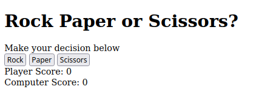
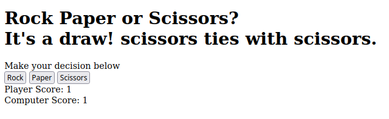
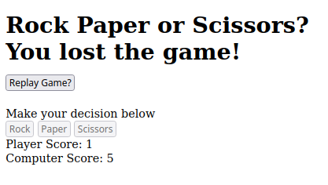

# Rock Paper Scissors

The point of this project was to practice the fundamentals of javascript.

### Functionality

* Use Query Selectors for buttons
* Use logic to determine who wins a round and who wins the game
* Player plays against computer
* First to five points wins
* Replay game with the push of a button!

### Screenshots

  <figure>
    <figcaption>Start page</figcaption>
    
  </figure>
  <figure>
    <figcaption>Draw result</figcaption>
    
  </figure>
  <figure>
    <figcaption>Replay option</figcaption>
    
  </figure>

### Key Takeaways

1. Unless it's being declared for the first time, functions will always be called when using parenthesis, even when they are being stored in a variable.

2. If you declare a variable, it must be used in the scope or else it will say it's been declared, but is never read.

3. A function MUST return something in most situations. Don't forget to add a return value!

4. If you pass a function as an argument to another function. You must execute that function inside of the new function, and you probably want to then store that returned value inside of a new variable so that it can be used throughout the new function.

5. Make sure you understand what logical operators are really doing.

6. Use a whiteboard to track flow of program.